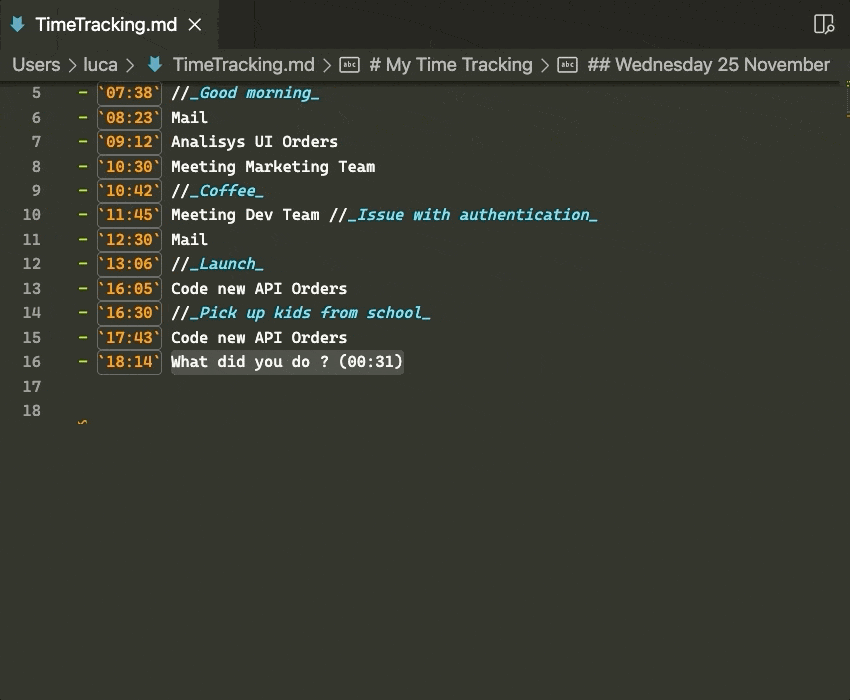
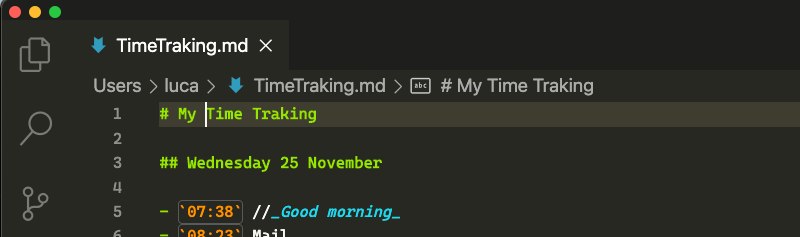
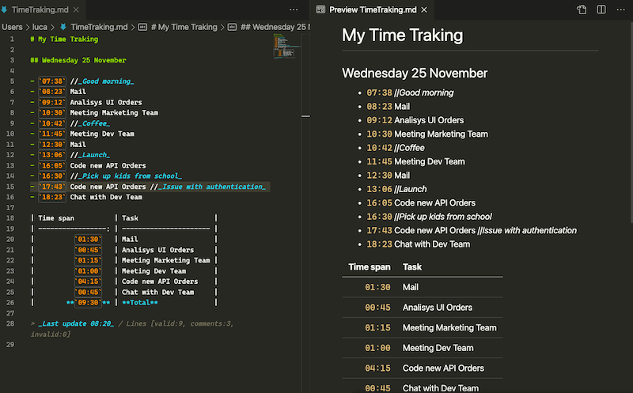

# My Time

This extension provides some commands to create a simple track of the day on a Markdown document.

## How to Use

The extension activates automatically when opening an Markdown file (.md).

The available commands are described in the following paragraphs.

### My Time: New Day

Create a title with the date and a first line that start the time track.

### My Time: New Task

Create a new Task line, to invoke this command you need to position the caret under the previous task or break. The line generated contains, the current time
and a placeholder for the task description. You can insert a comment after the task description if you use // as a separator.

### My Time: New Break

Create a new Break, to invoke this command you need to position the caret under the previous task or break. The line generated contains, the current time and a placeholder for the break description.

### My Time: Summary

Create a summary that calculate the duration of every task, the breaks are skipped.
To use the command you need to select all the tasks to summarize, if some rows in the selection are not valid they are skipped.

## Release Notes

### 0.9.5

Fix Readme images

### 0.9.0

Initial release

-----------------------------------------------------------------------------------

### Credits

* Modern JavaScript date utility library from date-fns.org
* Icon made by Pixel perfect from www.flaticon.com
